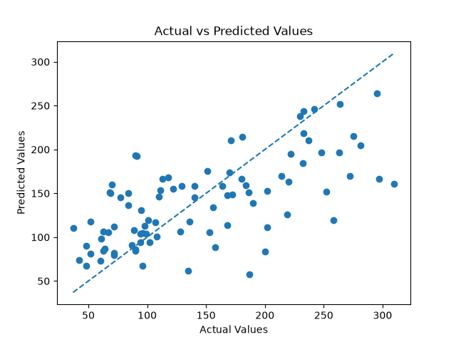
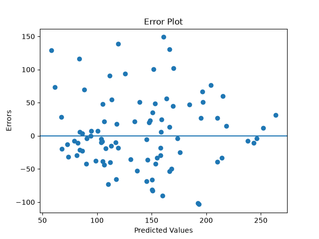

# K-Nearest Neighbors Regression from Scratch

This project implements K-Nearest Neighbors (KNN) Regression from scratch without relying on machine learning libraries. The implementation is validated by comparing its performance with scikit-learn's KNeighborsRegressor on the Diabetes dataset.

## Features

- KNN Regression implemented from scratch
- Euclidean distance calculation
- Distance sorting
- K nearest neighbors selection
- Average-based prediction
- Model evaluation using Mean Absolute Error
- Hyperparameter selection using validation data
- Comparison with scikit-learn
- Actual vs Predicted plot
- Residual plot

## Dataset

Diabetes Dataset

Source:
scikit-learn.datasets.load_diabetes()

## Algorithm

K-Nearest Neighbors Regression predicts a continuous target value based on the target values of the K nearest training samples.

The algorithm calculates the distance between a new sample and every training sample, selects the K nearest neighbors, and calculates the average of their target values to produce the prediction.

Prediction:

ŷ = (y₁ + y₂ + ... + yₖ) / k

The value of K is selected using validation performance, where Mean Absolute Error (MAE) is used as the evaluation metric.

## Implementation

- Loaded the Diabetes dataset.
- Implemented train-test splitting manually.
- Implemented feature scaling manually.
- Implemented Euclidean distance.
- Implemented distance calculation for all training samples.
- Labeled distances with their corresponding target values.
- Sorted the distances.
- Selected the K nearest neighbors.
- Implemented average-based prediction.
- Implemented a custom `predict()` function.
- Implemented Mean Absolute Error (MAE).
- Tested different K values using validation data.
- Selected the best K based on the lowest validation MAE.
- Compared the implementation with scikit-learn's `KNeighborsRegressor`.

## Results

| K | Validation MAE |
| -: | --------------: |
| 1 | 57.50 |
| 3 | 43.22 |
| 5 | 38.83 |
| 7 | 40.89 |
| 9 | 43.67 |

Best K selected using validation:

K = 5

Final test MAE:

42.9681

## Visualizations

## Actual vs Predicted

## Residual Plot

## Folder structure

KNN_Regression_Project/
│
├── plots/
│   ├── actual_vs_predicted.png
│   └── residual_plot.png
│
├── from_scratch.py
├── sklearn_model.py
├── visualization.py
├── README.md

## what I learned

- Implemented KNN Regression manually.
- Understand how Euclidean distance is used to find nearest neighbors.
- Learned how KNN predicts continuous values using the average of neighboring target values.
- Learned why feature scaling is important for distance-based algorithms.
- Learned how to select a hyperparameter using validation data.
- Comparing the difference between manual implementation and scikit-learn implementation.
- Evaluated the model using Mean Absolute Error (MAE).
- Learned the difference between KNN Classification and KNN Regression.

